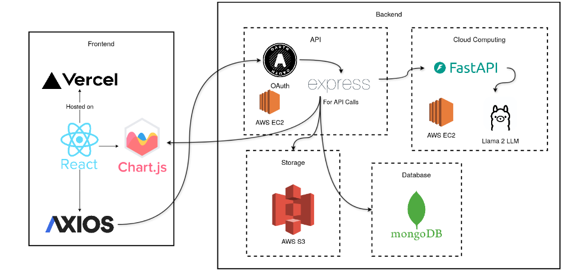

  

<em>A web-based platform built for educational institutions to automate annual report generation using Artificial Intelligence. The system leverages Large Language Models (LLMs) to process and organize unstructured data into structured, actionable insights. We are transforming raw data into interactive, detailed, and customized reports, one click at a time.</em>

## Problem Statement 

### SIH - 1641

> _Create an Annual Report Portal for institute where all the departmental reports can be integrated and customized._

## Description

Educational institutes generate vast amounts of data each year, including academic performance, research publications, financial statements, infrastructure developments, student and faculty achievements, and extracurricular activities. Preparing a comprehensive and insightful annual report that accurately reflects the institute's accomplishments and growth is a complex and time-consuming task. It requires the aggregation, organization, analysis, and presentation of diverse data sources in a coherent and visually appealing manner. Challenge Design and develop a user-friendly, efficient, and robust portal that streamlines the process of preparing the annual report for an educational institute.The portal should facilitate the collection, integration, analysis, and visualization of data from various departments and stakeholders within the institute. The goal is to create a dynamic, interactive, and automated system that minimizes manual effort, enhances accuracy, and provides valuable insights. Key Features and Requirements User Authentication and Role Management: Secure login for different user roles (administrators, faculty, students, etc.). Role-based access control to ensure data privacy and security. Data Collection and Integration: Import data from various sources (databases, spreadsheets, surveys, etc.). Integration with existing systems (student management systems, financial software, research databases, etc.). Support for manual data entry where necessary. Data Analysis and Visualization: Tools for analyzing academic performance, research output, financial data, and other metrics. Customizable dashboards for visualizing key performance indicators (KPIs). Graphs, charts, and other visual aids for presenting data trends and insights. Report Generation: Automated generation of the annual report in various formats (PDF, HTML, etc.). Customizable templates for different sections of the report. Inclusion of multimedia elements (images, videos, infographics). Collaboration and Feedback: Features for collaborative editing and review of report content. Mechanisms for collecting feedback from stakeholders. Version control to track changes and maintain document integrity. User Experience: Intuitive and user-friendly interface. Responsive design for accessibility on various devices (desktop, tablet, mobile). Multilingual support for institutes with diverse language needs. Compliance and Standards: Adherence to relevant educational and reporting standards. Data security and privacy compliance with regulations (GDPR, FERPA, etc.). Expected Outcomes Participants are expected to deliver a functional prototype of the annual report preparation portal that demonstrates the core features and addresses the outlined requirements. The solution should be scalable, adaptable to different types of educational institutes, and capable of handling large volumes of data.

##  Tech Stack

### Front-End

  
  
  
  
  

### Back-End

  
  
  

### Database

  
  
  

### Tools & Services

  
  
  
  
  

### Artificial Intelligence

  
  
  
  
  
  
  
### Deployement

  
  

## Architecture

  

  

---

## 2. Features 

## 3. Installation instructions

## 4. Configuration
All the details on configuration options,environment variables and how to set them.

## 5. API Documentation 
Details on any API used and Endpoints, request/response formats, and example calls.

## 6. Snippets of website 

## 7. Live-Link 
When deployed on vercel/netlify or whatever static site deployment we use.

## 8. Use-Cases

## 9. Deployment
Details on hosting services, deployment commands, and configuration.

## 10. License
Any legal information regarding the use and distribution of the project.

## 11. Contributors 
Github links of you all to be put in here and some contact info.

## 12. Contributing (optional)
Guidelines for contributing to the project.

